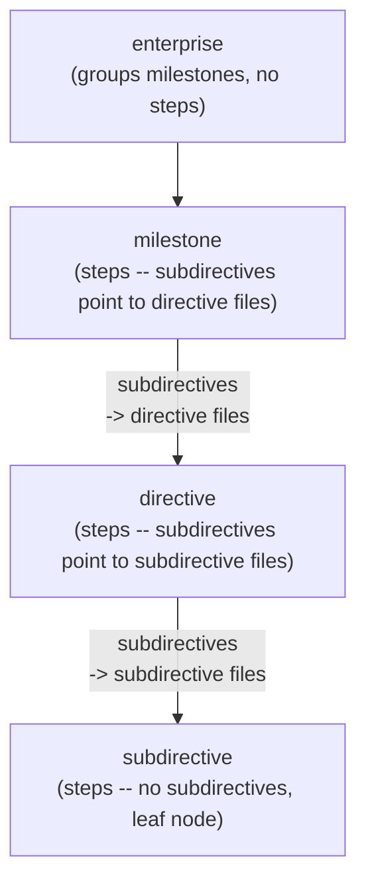

<!-- ─────────────────────────────────────────────────────────────────
  TOP-LEVEL STRUCTURE

  This file contains two parseable sections wrapped in XML tags:

    <spec>    — verification contract format (features, criteria, adversarial)
    <directive>   — execution artifact format (steps, subdirectives, verify)

  The parser splits on these two tags first, then applies section-specific
  parsing within each. Section-specific scalar metadata lives in the top-level
  YAML frontmatter under `spec:` and `directive:` nested keys — no inner YAML blocks.

  Both sections use the same primitives:
    - YAML frontmatter for scalar metadata (single block at file top)
    - XML tags for structured content (prose, nested blocks)
    - Free markdown inside XML tags (no escaping, no indentation rules)

  The <spec> tag always precedes <directive> in the combined file — verification
  contracts are defined before the execution plan that implements them.
───────────────────────────────────────────────────────────────────── -->


<spec>

<!-- ─────────────────────────────────────────────────────────────────
  This section is self-referential: it IS a spec that documents the spec format.
  The features and criteria here describe the format by being a valid example of it.

  DISCLOSURE MAP — who receives each spec field and when:

  id, milestone, goal, directive_ref
    Orchestrator only. Used to identify and link the spec at verification time.

  <feature> — description + criteria
    Verification agent ONLY.
    resolveSpecItems() maps the dot-notation ref to the criterion object.
    buildVerificationPrompt() renders: "### FEAT-01.CRIT-01\n**Description:** ...\n**Implementation:** ..."
    Injected into verify-step.md as ${criteria_block}.
    Event: after execution agent completes, before verification agent produces verdict.

  <adversarial>
    Verification agent ONLY. Injected on EVERY verification prompt for this spec —
    not filtered by which specific criteria the step references. This is the quality
    framework for the verification agent: it governs HOW to probe, not just WHAT to check.
    Injected as: ${adversarial_strategy}, ${adversarial_mutations},
                 ${adversarial_structural}, ${adversarial_test_quality}
───────────────────────────────────────────────────────────────────── -->


<feature id="FEAT-01" name="Spec Structure">
<description>
A spec organizes acceptance criteria into features. Directive steps reference criteria
using dot notation: `FEAT-01.CRIT-01` maps to this feature's CRIT-01. Features are
the top-level grouping — no intermediate phase layer.
</description>

<criterion id="CRIT-01" type="behavioral">
Spec markdown files with two features each containing two criteria parse into a typed
object with all four criteria accessible by dot-notation reference.

<implementation>
Given a spec markdown with FEAT-01 (CRIT-01 behavioral, CRIT-02 structural) and
FEAT-02 (CRIT-01 integration, CRIT-02 behavioral), the parsed SpecYaml has:
  features["FEAT-01"].criteria["CRIT-01"].implementation.type === "behavioral"
  features["FEAT-02"].criteria["CRIT-01"].implementation.type === "integration"

`implementation.type` must be the exact string, not truthy. The result must be a keyed
plain object, not an array.
</implementation>

<test_assertions>
  assert: "features['FEAT-01'].criteria is a plain object, not an array"   against: "object"
  assert: "Object.keys(features['FEAT-01'].criteria) contains CRIT-01"     against: "true"
  assert: "features['FEAT-02'].criteria['CRIT-01'].implementation.type"    against: "integration"
</test_assertions>
</criterion>

<criterion id="CRIT-02" type="structural">
Each `<criterion>` element's `id` attribute becomes the object key. Tag names are never
used as keys. Declaration order is preserved in `Object.keys(criteria)`.

<implementation>
Parser produces Object.keys(spec.features["FEAT-01"].criteria) === ["CRIT-01", "CRIT-02"]
in declaration order. A criterion with no `id` attribute causes a validation error — the
parser rejects the file rather than silently inferring a key.
</implementation>
</criterion>

</feature>


<feature id="FEAT-02" name="Dot-Notation Reference Resolution">
<description>
Directive steps reference criteria using dot notation. This feature defines how resolution
must behave: which collection the reference maps to and what happens with invalid references.
</description>

<criterion id="CRIT-01" type="behavioral">
Dot-notation references resolve to the correct criterion object regardless of how many
features or items the spec contains.

<implementation>
Given a step with acceptance_criteria ["FEAT-01.CRIT-01", "FEAT-02.CRIT-02"], the verifier
resolves both: FEAT-01.CRIT-01 -> features["FEAT-01"].criteria["CRIT-01"], FEAT-02.CRIT-02 ->
features["FEAT-02"].criteria["CRIT-02"]. Both return populated objects, not undefined.

FEAT-02.CRIT-99 (key not present) returns null, does not throw.
FEAT-99.CRIT-01 (feature not present) returns null, does not throw.
</implementation>

<test_assertions>
  assert: "FEAT-01.CRIT-01 resolution returns criterion with description"    against: "string"
  assert: "FEAT-02.CRIT-99 on spec without that key returns null"            against: "null"
  assert: "FEAT-99.CRIT-01 on spec without FEAT-99 returns null"             against: "null"
</test_assertions>
</criterion>

<criterion id="CRIT-02" type="structural">
The dot notation always resolves against the feature's `criteria` collection. There is
one collection per feature, not separate collections for different item types.

<implementation>
Given acceptance_criteria ["FEAT-01.CRIT-01", "FEAT-01.CRIT-02"] on the same step: both
resolve from features["FEAT-01"].criteria. Neither resolution interferes with the other.
</implementation>
</criterion>

</feature>


<feature id="FEAT-03" name="Combined Schema Parsing">
<description>
The combined schema file uses `<spec>` and `<directive>` as top-level container tags. The
parser splits on these tags first, then applies section-specific parsing within each.
Shared YAML frontmatter precedes both sections.
</description>

<criterion id="CRIT-01" type="structural">
The parser extracts `<spec>` and `<directive>` sections as independent parse units. Each
section has its own YAML frontmatter and body content. The shared frontmatter above
both sections provides combined metadata.

<implementation>
Given a combined schema file with a single YAML frontmatter containing `spec:` and `directive:`
nested keys, a `<spec>` section, and a `<directive>` section: the parser produces two objects —
one SpecYaml and one DirectiveYaml. Section-specific scalars (id, milestone, goal, etc.) come
from the nested frontmatter keys. The top-level `id` is the combined document identifier.
</implementation>

<test_assertions>
  assert: "parser reads spec metadata from frontmatter spec: key"       against: true
  assert: "parser reads directive metadata from frontmatter directive: key"     against: true
  assert: "spec section parses to SpecYaml with features"               against: true
  assert: "directive section parses to DirectiveYaml with steps"                against: true
</test_assertions>
</criterion>

<criterion id="CRIT-02" type="behavioral">
Content between `<spec>` and `</spec>` is parsed exclusively by the spec parser. Content
between `<directive>` and `</directive>` is parsed exclusively by the directive parser. Neither parser
sees the other section's content.

<implementation>
Given a combined file where the spec section has features FEAT-01 and FEAT-02, and the
directive section has steps 1, 2, and 3: the spec parser sees only the features, the directive
parser sees only the steps. No cross-contamination occurs.
</implementation>
</criterion>

</feature>


<adversarial>

<strategy>
Probe for parsers that pass tests only on well-formed input. Send specs with: missing
required tags, `id` attributes with wrong casing (`crit-01` vs `CRIT-01`), unknown tag names
inside `<feature>` blocks, features without any criteria, and criteria with no
`<implementation>` tag. Verify the parser rejects or surfaces each as a validation error —
no silent partial results.

Also probe the combined schema parsing: send a file where `<spec>` appears inside `<directive>`
(nested), or where `<directive>` precedes `<spec>`, or where one section is missing entirely.
Verify the parser handles each case with a clear error.
</strategy>

<mutations>
Mutate criterion `id` attributes (CRIT-01 -> CRIT-1, CRIT-01 -> crit-01) and verify the
parser either rejects or preserves the exact string as the map key without normalizing.
Swap feature ids (FEAT-01 -> FEAT-1, FEAT-01 -> feat-01) and verify dot-notation resolution
with the original key fails gracefully — returns null, not a throw.
</mutations>

<structural>
Check that the parser uses element `id` attributes as map keys, never element tag names.
Check that features are separate top-level keys, not merged or flattened.
Verify criterion description is read from element text content, not an attribute.
Verify `<implementation>` content is stored as a plain string — no re-parsing or interpretation.
Verify `<description>` is required on every feature and extracted as free markdown.

For the combined schema: check that `<spec>` and `<directive>` are parsed as top-level container
tags that isolate their contents from each other. The shared frontmatter must not leak into
either section's parsed frontmatter.
</structural>

<test_quality>
Assertions must check specific field values. `implementation.type` must equal the exact enum
string (`"behavioral"`, not truthy). `Object.keys(features)` must return exact feature ids in
declaration order, not a superset. Tests must fail if `criteria` is an array
instead of a keyed map. Numeric `against` values must use strict equality, not loose.
</test_quality>

</adversarial>


<!-- ─────────────────────────────────────────────────────────────────
  SPEC FIELD REFERENCE

  -- Frontmatter (inside <spec> section) ──────────────────────────────
  id              required  string         unique identifier
  milestone       required  string         milestone slug
  goal            required  string (block) high-level outcome this spec validates
  directive_ref       optional  string         paired directive id

  -- Feature (<feature id="FEAT-XX" name="...">) ────────────────────
  id              required  attribute      feature key: FEAT-01, FEAT-02, ...
  name            required  attribute      short human-readable name
  <description>   required  free markdown  what this capability does; human-readable
  <criterion>     required  1+             acceptance criteria for this feature

  -- Criterion (<criterion id="CRIT-XX" type="...">) ─────────────────
  id              required  attribute      map key: CRIT-01, CRIT-02, ...
  type            required  attribute      behavioral | structural | performance | integration
  body prose      optional  free markdown  testable behavioral statement; what must be true
  <implementation> required  free markdown  concrete verification scenario; multi-line supported;
                                           code blocks and shell commands render verbatim
  <test_assertions> optional  YAML-like    one "assert: ... against: ..." line per assertion
                                           against: string | number

  -- Adversarial block (<adversarial>) -- all four sub-tags required ──
  <strategy>      free markdown  probing approach: how to detect faking and shortcuts
  <mutations>     free markdown  inputs to mutate to confirm real implementation
  <structural>    free markdown  source code patterns that signal quality failure
  <test_quality>  free markdown  how to verify tests assert specific meaningful values

  -- Dot-notation reference rules ───────────────────────────────────
  FEAT-01.CRIT-01  ->  features["FEAT-01"].criteria["CRIT-01"]
  Always use the full form: FEAT-01.CRIT-01, never bare CRIT-01.

  -- Implementation type enum ───────────────────────────────────────
  behavioral    observable input/output behavior
  structural    source code structure (no hardcoding, no catch-alls)
  performance   latency, throughput, resource bounds
  integration   behavior across system boundaries (API, DB, filesystem)
───────────────────────────────────────────────────────────────────── -->

</spec>


<directive>
<!-- ─────────────────────────────────────────────────────────────────
  This section is self-referential: it IS a directive that demonstrates the execution
  artifact format it documents.
───────────────────────────────────────────────────────────────────── -->

<scope>
This section is the canonical reference for the execution artifact format used by the
deep execution engine. It is self-referential — it IS a directive artifact that demonstrates
the format it documents.

**Unified step lifecycle.** Every step follows the same three-phase pipeline regardless of
hierarchy level. The phases execute in declaration order — tag order IS execution order:

```
<prompt>       ->  agent executes the task
<subdirectives>   ->  fan-out children execute (optional, after prompt completes)
                   child worktrees merge back in declaration order
<verify>       ->  verification gate (runs on merged result)
```

This means a single step can do agent work, fan out to children, and verify the combined
result — all within one step declaration. The presence of `<subdirectives>` triggers the
fan-out phase; its absence means the step is agent-work-only.

**Unified recursive execution model.** The execution engine runs the same way at every
level of the hierarchy. The artifact type determines depth — not behavior:



The execution loop at every non-leaf level:

```typescript
// Same function at every level — milestone, directive, subdirective
async function runArtifact(artifact: DirectiveYaml, config: RunConfig): Promise<void> {
  for (const step of artifact.steps) {
    // Phase 1: dispatch prompt to execution agent
    await dispatchPrompt(step, cwd, artifact.principle);

    // Phase 2: fan out to subdirectives (if present)
    if (step.subdirectives?.length) {
      await fanOutSubdirectives(step.subdirectives, cwd);
      await mergeSubdirectives(step.subdirectives, cwd, step.merge_strategy);
    }

    // Phase 3: verification gate
    if (step.verify) {
      await verifyStep(step, cwd);
    }
  }
}
```

**Agent-generated subdirectives.** Because the prompt phase runs before subdirectives, an agent
can create the directive files that subdirectives will execute. The step's prompt instructs the
agent to research and produce directive artifacts;; `<subdirectives>` then picks up those files
and executes them. This subsumes the progressive step concept — no special step types needed.

All content inside XML tags is free markdown. No escaping, no indentation rules, no block
scalar syntax. Code blocks, Mermaid diagrams, and shell commands all render verbatim.
</scope>

<principle>
Every field in the field reference must appear in at least one example within this section.
The format must be learnable by reading one artifact — no external cross-referencing.
The unified step lifecycle (prompt -> subdirectives -> verify) must be demonstrable from the
schema alone. Tag order within a step must reflect execution order.
</principle>


<step number="1" worktree="agents/unified-execution-schema" merge_strategy="none">
<name>basic-step-format</name>
<profile>agentic_engineer</profile>
<acceptance_criteria>
- FEAT-01.CRIT-01
- FEAT-01.CRIT-02
</acceptance_criteria>
<principle>
Every documented field must be present with correct type and disclosure party. The schema
demonstrates itself by fully conforming to itself.
</principle>
<prompt>
`<prompt>` wraps the full task the execution agent receives. It is required on all steps.
Content is free markdown: code blocks, diagrams, shell commands, and file paths all render
verbatim with no escaping.

Write the prompt as an elaborate, self-contained task description. The agent has no
context outside this file, so the prompt must include: what files to modify, what the
expected state is after completion, and constraints that bound the work.

**Step attributes** (on the opening `<step>` tag):
- `number` — sequential position within the artifact (integer, required)
- `worktree` — "none" or a path like `agents/directive-name` (string, required)
- `merge_strategy` — how child worktrees merge back: `auto | agentic | none` (optional;
  only meaningful when `<subdirectives>` is present; defaults to "auto")

**Tag ordering within a step** — declaration order reflects execution order:

1. Identity and metadata: `<name>`, `<profile>`, `<depends_on>`, `<acceptance_criteria>`,
   `<principle>` — these configure the step before execution begins.
2. `<prompt>` — dispatched to the execution agent (Phase 1).
3. `<subdirectives>` — fan-out children; executed after the agent completes the prompt (Phase 2).
   Child worktrees are merged back in declaration order.
4. `<verify>` — verification strategy; runs after subdirectives merge back (Phase 3).
5. `<on_failure>` — retry and escalation policy.

A step without `<subdirectives>` is agent-work-only: prompt runs, then verify. A step with
`<subdirectives>` is a full lifecycle: prompt runs, children fan out and merge, then verify
checks the combined result.
</prompt>
<verify>
Confirm the schema section correctly demonstrates every field it documents, and that the
self-referential format holds — the section IS a directive that conforms to its own rules.

**What to check:** Every field listed in the field reference appears in at least one
example within this section. Every step attribute (`number`, `worktree`, `merge_strategy`)
is present on all example steps. Inner tags — `<name>`, `<profile>`, `<acceptance_criteria>`,
`<principle>`, `<verify>`, `<on_failure>`, `<prompt>` — each appear in at least one step
with plausible values. Tag ordering within steps follows execution order: metadata tags
first, then `<prompt>`, then `<subdirectives>` (if present), then `<verify>`, then `<on_failure>`.

**Expected results:** A reader can learn the complete format by reading this section alone,
without consulting any other document. The field reference at the bottom matches what the
examples show — no field is documented but not demonstrated.

**Anti-patterns to detect:**
- Fields listed in the reference that have no corresponding example (documentation drift).
- Example steps that use attributes or tags not listed in the reference (undocumented usage).
- Tags that appear out of execution order — `<verify>` before `<prompt>`, or `<subdirectives>`
  before `<prompt>`, would misrepresent the execution lifecycle.
- The `<verify>` tag containing only a shell command instead of a verification strategy —
  this step is the canonical demonstration of what `<verify>` should contain.
</verify>
<on_failure retry="1" escalate="abort"/>
</step>


<step number="2" worktree="agents/unified-execution-schema" merge_strategy="auto">
<name>step-with-subdirectives</name>
<profile>agentic_engineer</profile>
<depends_on>basic-step-format</depends_on>
<acceptance_criteria>
- FEAT-02.CRIT-01
</acceptance_criteria>
<prompt>
This step demonstrates the full three-phase lifecycle: **prompt -> subdirectives -> verify**.

The agent first executes this prompt — it does preparatory work, research, or scaffolding.
After the agent completes, the execution engine fans out to the subdirective files listed in
`<subdirectives>`. Each subdirective runs in its own worktree forked from this step's worktree.
When all subdirectives complete, their worktrees merge back into the parent in declaration
order. Finally, `<verify>` runs on the merged result.

**Agent-generated subdirectives.** The prompt phase can instruct the agent to CREATE the
directive files that `<subdirectives>` will execute. For example:

```xml
<prompt>
Research the authentication requirements for this module. Based on your findings, create
two directive files:
- `subdirectives/auth-middleware.md` — middleware implementation
- `subdirectives/auth-routes.md` — route protection

Each file must conform to the unified execution schema with type: subdirective.
</prompt>
<subdirectives>
  subdirectives/auth-middleware.md
  subdirectives/auth-routes.md
</subdirectives>
```

The agent creates the files during the prompt phase. The execution engine picks them up
and runs them during the subdirectives phase. This is the general pattern for progressive
or wave-based execution — no special step types needed.

**Hierarchy depth.** `<subdirectives>` is the same tag at every level:
- In a **milestone** step: paths point to directive files
- In a **directive** step: paths point to subdirective files
- In a **subdirective** step: `<subdirectives>` is forbidden (leaf node)

The execution engine does not distinguish between these cases. It fans out to whatever
files are listed and recursively executes them.

**Merge behavior.** After all subdirectives complete, their worktrees merge back into the
parent worktree in the order they appear in `<subdirectives>`. The `merge_strategy` attribute
on the `<step>` tag controls how merges happen:
- `auto` — `git merge --no-ff`, halt on conflict
- `agentic` — dispatch a merge-resolution agent on conflict
- `none` — skip merge, preserve worktrees for manual handling
</prompt>
<subdirectives>
  examples/subdirective-a.md
  examples/subdirective-b.md
</subdirectives>
<verify>
Confirm subdirective fan-out is correctly wired, the three-phase lifecycle executes in order,
and the merged result is coherent.

**What to check:** Each path in `<subdirectives>` resolves to an existing file that parses
as a valid artifact. Subdirective files are leaf nodes — they must not contain `<subdirectives>`
in any of their steps. The merge happened in declaration order: subdirective-a first, then
subdirective-b. The `<verify>` phase ran AFTER the merge completed, not before.

**Expected results:** The orchestrator dispatches the prompt to an agent. After the agent
completes, it spawns one worktree per subdirective and runs them concurrently. After all
subdirectives complete, worktrees merge back in declaration order. Finally, the verify
strategy runs against the merged result.

**Anti-patterns to detect:**
- Subdirective paths resolved from CWD instead of from the directive file's directory.
- Subdirective files that themselves contain `<subdirectives>` — subdirectives are leaf nodes.
- Verify running before subdirectives complete — the three phases must execute in order.
- Merge order different from declaration order in `<subdirectives>` — order matters when
  children touch the same files.
</verify>
<on_failure retry="1" escalate="abort"/>
</step>


<step number="3" worktree="agents/unified-execution-schema" merge_strategy="none">
<name>minimal-step-format</name>
<depends_on>step-with-subdirectives</depends_on>
<prompt>
This step demonstrates the **minimum viable step**: only `<name>` and `<prompt>` are
required. All other inner tags are optional:

```xml
<step number="3" worktree="agents/my-directive" merge_strategy="none">
<name>do-the-thing</name>
<prompt>
Implement the feature as described.
</prompt>
</step>
```

When optional tags are absent:
- `<profile>` defaults to `agentic_engineer`
- `<depends_on>` — no dependencies; step runs when its turn comes
- `<acceptance_criteria>` — no spec criteria to verify against
- `<principle>` — falls back to the directive-level principle
- `<subdirectives>` — no fan-out; step is agent-work-only
- `<verify>` — no verification gate; step passes when the agent completes
- `<on_failure>` — defaults to `retry="3" escalate="abort"`
</prompt>
</step>


<!-- DIRECTIVE FIELD REFERENCE

  -- Execution Hierarchy ──────────────────────────────────────────────
  The execution engine is the same function at every level. Artifact type
  determines depth — not behavior.

    enterprise  (no steps — pure grouping of milestones)
    +-- milestone  (steps; subdirectives -> directive files)
          +-- directive  (steps; subdirectives -> subdirective files)
                +-- subdirective  (steps; no subdirectives — leaf node)

  Depth constraint by level:
    milestone steps:   subdirectives point to directive files
    directive steps:       subdirectives point to subdirective files
    subdirective steps:   <subdirectives> is forbidden (leaf node)

  -- Step Lifecycle ─────────────────────────────────────────────────────
  Every step follows the same three-phase pipeline. Tag order = execution order.

    Phase 1: <prompt>       dispatched to execution agent
    Phase 2: <subdirectives>   fan-out children execute, then merge back
    Phase 3: <verify>       verification gate on merged result

  Phase 2 is triggered by the presence of <subdirectives>. Without it, the
  step is agent-work-only: prompt -> verify.

  -- Shared frontmatter (all types) ────────────────────────────────────
  id              required  string              unique artifact identifier, kebab-case
  type            required  (see enum)          discriminator
  title           required  string              human-readable title
  directive_type  optional  (see enum)          reference | executable (default: executable)
  base_branch     optional  string              branch to fork from (default: HEAD)

  -- Directive / subdirective frontmatter ──────────────────────────────────
  spec            required  string              path to paired spec file
  cleanup         optional  (see enum)          worktree cleanup policy
  merge_strategy  optional  (see enum)          directive-level merge default

  -- Directive / subdirective body tags ────────────────────────────────────
  <scope>         required  free markdown       party: orchestrator; bounds the work unit
  <principle>     required  free markdown       party: execution agent; injected at every
                                                step dispatch as "## Principle: ${principle}";
                                                step-level <principle> overrides it per-step
  <step ...>      required  1+                  execution steps (see step fields below)

  -- Subdirective frontmatter ───────────────────────────────────────────
  parent_directive    required  string              id of the spawning parent directive

  -- Milestone frontmatter ─────────────────────────────────────────────
  merge_strategy  optional  (see enum)          milestone-level merge default

  -- Milestone body tags ───────────────────────────────────────────────
  Milestones use the same <step> format as directives. Steps with <subdirectives>
  point to directive files (one level down in the hierarchy).

  <step ...>      required  1+                  same format as directive steps; subdirectives
                                                point to directive files at this level

  -- Enterprise frontmatter ────────────────────────────────────────────
  schedule        optional  string              cron or scheduling hint; not agent-visible

  -- Enterprise body tag ───────────────────────────────────────────────
  <milestones>    required  paths               child milestone files; one per line

  -- Step attributes (on opening <step> tag) ───────────────────────────
  number          required  integer         sequential position within the artifact
  worktree        required  string          "none" or a path (e.g. agents/directive-name)
  merge_strategy  optional  (see enum)      merge policy for child worktrees; only
                                            meaningful when <subdirectives> present;
                                            defaults to "auto" with subdirectives, "none" without

  -- Step inner tags (declaration order = execution order) ──────────────
  FIELD                 REQ  PARTY               NOTES
  <name>                yes  orchestrator        unique within artifact; kebab-case; state key
  <profile>             no   orchestrator        agent persona (default: agentic_engineer)
  <depends_on>          no   orchestrator        step names; one per line
  <acceptance_criteria> no   execution agent     bullet list: "- FEAT-01.CRIT-01" one per line
                             verification agent  post-execution: resolved spec criterion objects
  <principle>           no   execution agent     "## Principle:" in dispatch prompt;
                                                 step-level override of artifact-level principle
  <prompt>              yes  execution agent     full task prompt; free markdown; code blocks
                                                 and diagrams supported; injected verbatim
                                                 PHASE 1: dispatched to agent
  <subdirectives>          no   orchestrator        child artifact paths; one per line;
                                                 PHASE 2: fan-out after prompt completes;
                                                 children execute concurrently in own worktrees;
                                                 merge back in declaration order;
                                                 forbidden in subdirective steps (leaf node)
  <verify>              yes* verification agent  natural language verification strategy:
                                                 what to check, how, expected results, and
                                                 anti-patterns to detect;
                                                 PHASE 3: runs after subdirectives merge back;
                                                 *required on steps with subdirectives or
                                                 acceptance_criteria; optional otherwise
  <on_failure .../>     no   orchestrator        retry="N" escalate="abort|continue|pause"

  -- Enums ──────────────────────────────────────────────────────────────
  type (frontmatter)     milestone | enterprise | directive | subdirective
  directive_type         reference | executable           (default: executable)
                         "reference" excludes artifact from execution queries
  cleanup                on-success | always | never        (default: on-success)
  merge_strategy         auto | agentic | none
  worktree               "none" | path string
  escalate               abort | continue | pause           (default: abort)
  profile                agentic_engineer | test_engineer | backend_developer |
                         frontend_developer | researcher | solutions_architect |
                         business_analyst | quantitative_developer
-->

</directive>


<!-- ─────────────────────────────────────────────────────────────────
  COMBINED SCHEMA PARSING RULES

  1. Single frontmatter: One YAML block at file top (between --- fences).
     Contains shared metadata (id, title, goal) plus section-specific metadata
     under nested `spec:` and `directive:` keys. No YAML blocks inside XML sections.

  2. <spec> section: Everything between <spec> and </spec>. Section-specific
     scalars (id, milestone, goal, directive_ref) come from frontmatter `spec:` key.
     Body contains <feature> and <adversarial> blocks. Parsed by the spec parser.

  3. <directive> section: Everything between <directive> and </directive>. Section-specific
     scalars (id, type, title, spec, base_branch, cleanup, directive_type) come from
     frontmatter `directive:` key. Body contains <scope>, <principle>, and <step> blocks.
     Parsed by the directive parser.

  4. Ordering: <spec> MUST precede <directive>. The verification contract is defined
     before the execution plan that implements it.

  5. Standalone files: Spec-only files and directive-only files do NOT use
     <spec>/<directive> wrapper tags. Their frontmatter is flat (no nesting). The
     combined format with nested frontmatter and wrapper tags is for schema reference
     documents only.

  6. Self-reference: In this file, the spec's directive_ref points to the combined
     document id. The directive's spec field points to this same file. Both sections
     reference each other through the shared document.

  7. directive_type: The `directive_type` frontmatter field controls whether an artifact
     is executable. `reference` artifacts are excluded from execution queries — they are
     schema documentation, not work units. Default is `executable`.
───────────────────────────────────────────────────────────────────── -->
