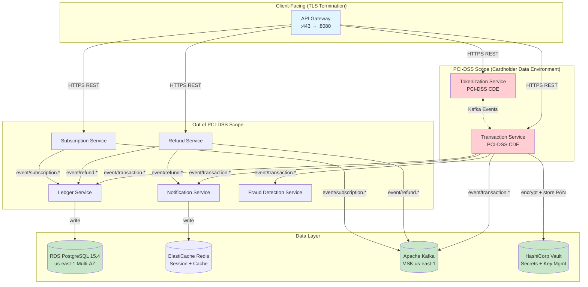

# ADR-001: Payment Processing Platform Microservices Architecture

**Status:** Accepted  
**Date:** 2026-04-08  
**Deciders:** architect_lead, builder_lead  
**Context:** Monolithic payment service at 1,200 TPS scaling limit; business requires 5,000 TPS for Q3 premium tier launch; PCI-DSS Level 1 compliance mandatory.

---

## 1. Context and Problem Statement

The current monolithic payment service (`payment-service`) handles credit card transactions, refunds, and subscription billing in a single deployable unit. It has reached a vertical scaling ceiling at approximately 1,200 TPS. The business has committed to a 5,000 TPS target for the Q3 premium tier launch. A decomposed microservices architecture is required to enable horizontal scaling, independent service deployment, team parallelization, and PCI-DSS scope reduction.

The system must:
- Process 5,000 transactions per second at p99 latency under 200ms
- Handle credit card transactions, refunds, and subscription billing
- Maintain PCI-DSS Level 1 compliance
- Deploy to AWS us-east-1 on EKS 1.28 with RDS PostgreSQL 15.4
- Use synchronous REST for client-facing APIs and asynchronous Kafka for inter-service events

---

## 2. Decision Drivers

| Driver | Weight | Description |
|--------|--------|-------------|
| Horizontal scalability | Critical | Monolith cannot scale beyond 1,200 TPS; business requires 5,000 TPS |
| PCI-DSS scope reduction | Critical | Minimize cardholder data environment (CDE) surface |
| Team parallelization | High | Builder_lead needs independent service deployment capability |
| p99 < 200ms latency | High | Payment processing latency SLA |
| Operational simplicity | Medium | Reduce distributed system complexity where possible |
| Resilience | High | Circuit breaker, retry, and graceful degradation required |

---

## 3. Considered Options

### Option A: Strangler Fig (Incrementally decompose monolith)

**Pros:**
- Lowest risk migration path
- Existing monolith continues serving traffic during transition
- Each service can be extracted and tested independently

**Cons:**
- Longest time to reach full decomposition (6-12 months)
- Maintaining dual code paths (old + new) increases cognitive load
- Network hop latency accumulates during transition period
- Difficult to enforce consistent API contracts across old/new code

**Verdict:** Rejected. Does not meet Q3 timeline constraint.

### Option B: Big Bang Rewrite (Decompose all at once)

**Pros:**
- Clean slate; no legacy debt
- Full parallelization across teams immediately
- Consistent API design from day one

**Cons:**
- Highest risk; no fallback once cutover begins
- 3-6 months before any revenue-generating traffic possible
- Business cannot wait this long

**Verdict:** Rejected. Timeline unacceptable.

### Option C: Domain-Driven Design Decomposition with Targeted Extraction

**Pros:**
- Balances risk and speed (3-4 month target)
- Extract highest-scale components first (transaction processing, tokenization)
- Each extracted service is independently deployable and testable
- PCI-DSS scope reduction achieved in first iteration
- Supports 5,000 TPS horizontal scaling from day one

**Cons:**
- Requires careful boundary design to avoid premature decomposition
- Distributed transactions require saga pattern implementation
- More operational complexity than monolith

**Verdict:** Selected. Best fit for timeline and scaling requirements.

---

## 4. Decision Outcome

**Selected:** Option C — Domain-Driven Design Decomposition with targeted extraction order:

1. **Phase 1 (Sprint 1-4):** Extract Tokenization Service + API Gateway + Kafka infrastructure
2. **Phase 2 (Sprint 5-8):** Extract Transaction Service + Refund Service
3. **Phase 3 (Sprint 9-12):** Extract Subscription Service + Ledger Service + Notification Service

This produces a 7-service architecture with PCI-DSS scope boundary around the Tokenization Service and Transaction Service only.

---

## 5. Service Boundary Diagram



### Service Responsibilities

| Service | Responsibility | PCI-DSS Scope | Scaling Model |
|---------|---------------|---------------|---------------|
| **API Gateway** | Auth, rate limiting, request routing, TLS termination | No | HPA (2-20 pods) |
| **Tokenization Service** | PAN → token conversion, encryption at rest, token vault | **Yes (CDE)** | HPA (3-15 pods) |
| **Transaction Service** | Authorization, capture, void, card data routing | **Yes (CDE)** | HPA (5-30 pods) |
| **Refund Service** | Refund initiation, partial/full refund, refund ledger | No | HPA (2-10 pods) |
| **Subscription Service** | Billing schedule, recurring charges, plan management | No | HPA (2-10 pods) |
| **Ledger Service** | Double-entry bookkeeping, event sourcing | No | HPA (3-12 pods) |
| **Notification Service** | Webhooks, email, SMS, push notifications | No | HPA (2-8 pods) |
| **Fraud Detection Service** | ML scoring, risk rules, velocity checks | No | HPA (2-8 pods) |

---

## 6. API Contracts

### 6.1 API Gateway

**Base Path:** `/api/v1`  
**Auth:** Bearer JWT (RS256)  
**Rate Limit Headers:**
- `X-RateLimit-Limit: 5000`
- `X-RateLimit-Remaining: 4999`
- `X-RateLimit-Reset: 1712534400`
- `Retry-After: 120` (on 429)

```yaml
openapi: 3.1.0
info:
  title: Payment Gateway API
  version: 1.0.0
  description: Client-facing payment processing API
servers:
  - url: https://api.pay.example.com/api/v1
    description: Production
paths:
  /transactions:
    post:
      operationId: createTransaction
      summary: Create a new payment transaction
      tags: [Transactions]
      security:
        - bearerAuth: []
      requestBody:
        required: true
        content:
          application/json:
            schema:
              $ref: '#/components/schemas/CreateTransactionRequest'
      responses:
        '202':
          description: Transaction accepted for processing
          headers:
            X-Transaction-Id:
              schema: { type: string }
              description: Server-generated transaction ID
            X-RateLimit-Remaining:
              schema: { type: integer }
            X-RateLimit-Reset:
              schema: { type: integer }
          content:
            application/json:
              schema:
                $ref: '#/components/schemas/TransactionAcceptedResponse'
        '400':
          $ref: '#/components/responses/BadRequest'
        '401':
          $ref: '#/components/responses/Unauthorized'
        '422':
          $ref: '#/components/responses/UnprocessableEntity'
        '429':
          $ref: '#/components/responses/TooManyRequests'
  /transactions/{transactionId}:
    get:
      operationId: getTransaction
      summary: Get transaction status
      tags: [Transactions]
      security:
        - bearerAuth: []
      parameters:
        - name: transactionId
          in: path
          required: true
          schema: { type: string, format: uuid }
      responses:
        '200':
          description: Transaction details
          content:
            application/json:
              schema:
                $ref: '#/components/schemas/TransactionResponse'
        '404':
          $ref: '#/components/responses/NotFound'
  /transactions/{transactionId}/void:
    post:
      operationId: voidTransaction
      summary: Void a pending transaction
      tags: [Transactions]
      security:
        - bearerAuth: []
      parameters:
        - name: transactionId
          in: path
          required: true
          schema: { type: string, format: uuid }
      responses:
        '202':
          description: Void accepted
          content:
            application/json:
              schema:
                $ref: '#/components/schemas/TransactionAcceptedResponse'
  /refunds:
    post:
      operationId: createRefund
      summary: Create a refund for a captured transaction
      tags: [Refunds]
      security:
        - bearerAuth: []
      requestBody:
        required: true
        content:
          application/json:
            schema:
              $ref: '#/components/schemas/CreateRefundRequest'
      responses:
        '202':
          description: Refund accepted
          content:
            application/json:
              schema:
                $ref: '#/components/schemas/RefundAcceptedResponse'
        '400':
          $ref: '#/components/responses/BadRequest'
        '404':
          $ref: '#/components/responses/NotFound'
  /subscriptions:
    post:
      operationId: createSubscription
      summary: Create a new subscription
      tags: [Subscriptions]
      security:
        - bearerAuth: []
      requestBody:
        required: true
        content:
          application/json:
            schema:
              $ref: '#/components/schemas/CreateSubscriptionRequest'
      responses:
        '201':
          description: Subscription created
          content:
            application/json:
              schema:
                $ref: '#/components/schemas/SubscriptionResponse'
  /subscriptions/{subscriptionId}:
    get:
      operationId: getSubscription
      summary: Get subscription details
      tags: [Subscriptions]
      security:
        - bearerAuth: []
      parameters:
        - name: subscriptionId
          in: path
          required: true
          schema: { type: string, format: uuid }
      responses:
        '200':
          description: Subscription details
          content:
            application/json:
              schema:
                $ref: '#/components/schemas/SubscriptionResponse'
    delete:
      operationId: cancelSubscription
      summary: Cancel a subscription
      tags: [Subscriptions]
      security:
        - bearerAuth: []
      parameters:
        - name: subscriptionId
          in: path
          required: true
          schema: { type: string, format: uuid }
      responses:
        '204':
          description: Subscription cancelled
  /tokens:
    post:
      operationId: tokenizeCard
      summary: Tokenize a card number (client-side tokenization SDK calls this directly)
      tags: [Tokens]
      security:
        - bearerAuth: []
      requestBody:
        required: true
        content:
          application/json:
            schema:
              $ref: '#/components/schemas/TokenizeRequest'
      responses:
        '201':
          description: Token created
          content:
            application/json:
              schema:
                $ref: '#/components/schemas/TokenResponse'
components:
  securitySchemes:
    bearerAuth:
      type: http
      scheme: bearer
      bearerFormat: JWT
  schemas:
    CreateTransactionRequest:
      type: object
      required: [amount, currency, paymentMethodToken, merchantId, idempotencyKey]
      properties:
        amount:
          type: integer
          minimum: 1
          description: Amount in smallest currency unit (cents)
          example: 4999
        currency:
          type: string
          minLength: 3
          maxLength: 3
          example: USD
        paymentMethodToken:
          type: string
          description: Tokenized card reference from tokenization service
          example: tok_1NxP8E2eZvKYlo2Cn5abcXYZ
        merchantId:
          type: string
          format: uuid
          description: Merchant identifier
        idempotencyKey:
          type: string
          minLength: 1
          maxLength: 255
          description: Unique key for request idempotency
          example: idem_7f8a9b2c3d4e5f6a
        capture:
          type: boolean
          default: true
          description: Whether to capture immediately or authorize only
        metadata:
          type: object
          additionalProperties: true
          description: Arbitrary key-value pairs
    TransactionAcceptedResponse:
      type: object
      properties:
        transactionId:
          type: string
          format: uuid
        status:
          type: string
          enum: [pending, authorized, captured, declined, voided]
        amount:
          type: integer
        currency:
          type: string
        createdAt:
          type: string
          format: date-time
    TransactionResponse:
      type: object
      properties:
        transactionId:
          type: string
          format: uuid
        status:
          type: string
          enum: [pending, authorized, captured, declined, voided, refunded, partially_refunded]
        amount:
          type: integer
        currency:
          type: string
        paymentMethodToken:
          type: string
        merchantId:
          type: string
          format: uuid
        capturedAt:
          type: string
          format: date-time
          nullable: true
        voidedAt:
          type: string
          format: date-time
          nullable: true
        refundedAmount:
          type: integer
          nullable: true
        metadata:
          type: object
          additionalProperties: true
        createdAt:
          type: string
          format: date-time
    CreateRefundRequest:
      type: object
      required: [transactionId, amount, idempotencyKey]
      properties:
        transactionId:
          type: string
          format: uuid
        amount:
          type: integer
          minimum: 1
          description: Refund amount in smallest currency unit
          example: 1999
        reason:
          type: string
          enum: [duplicate, fraudulent, customer_request, other]
        idempotencyKey:
          type: string
    RefundAcceptedResponse:
      type: object
      properties:
        refundId:
          type: string
          format: uuid
        transactionId:
          type: string
          format: uuid
        status:
          type: string
          enum: [pending, processed, failed]
        amount:
          type: integer
        createdAt:
          type: string
          format: date-time
    CreateSubscriptionRequest:
      type: object
      required: [planId, paymentMethodToken, merchantId, idempotencyKey]
      properties:
        planId:
          type: string
          format: uuid
        paymentMethodToken:
          type: string
        merchantId:
          type: string
          format: uuid
        customerId:
          type: string
          format: uuid
        idempotencyKey:
          type: string
        metadata:
          type: object
    SubscriptionResponse:
      type: object
      properties:
        subscriptionId:
          type: string
          format: uuid
        planId:
          type: string
          format: uuid
        status:
          type: string
          enum: [active, paused, cancelled, past_due, expired]
        currentPeriodStart:
          type: string
          format: date-time
        currentPeriodEnd:
          type: string
          format: date-time
        createdAt:
          type: string
          format: date-time
    TokenizeRequest:
      type: object
      required: [cardNumber, expMonth, expYear, cvv]
      properties:
        cardNumber:
          type: string
          pattern: '^[0-9]{13,19}$'
        expMonth:
          type: integer
          minimum: 1
          maximum: 12
        expYear:
          type: integer
          minimum: 2024
          maximum: 2050
        cvv:
          type: string
          pattern: '^[0-9]{3,4}$'
    TokenResponse:
      type: object
      properties:
        token:
          type: string
          description: PCI-DSS token representing the card
          example: tok_1NxP8E2eZvKYlo2Cn5abcXYZ
        expiresAt:
          type: string
          format: date-time
        cardBrand:
          type: string
          example: visa
        last4:
          type: string
          example: '4242'
  responses:
    BadRequest:
      description: Invalid request parameters
      content:
        application/json:
          schema:
            $ref: '#/components/schemas/ErrorResponse'
    Unauthorized:
      description: Missing or invalid authentication
      content:
        application/json:
          schema:
            $ref: '#/components/schemas/ErrorResponse'
    NotFound:
      description: Resource not found
      content:
        application/json:
          schema:
            $ref: '#/components/schemas/ErrorResponse'
    UnprocessableEntity:
      description: Business rule violation
      content:
        application/json:
          schema:
            $ref: '#/components/schemas/ErrorResponse'
    TooManyRequests:
      description: Rate limit exceeded
      headers:
        Retry-After:
          schema: { type: integer }
          description: Seconds to wait before retrying
      content:
        application/json:
          schema:
            $ref: '#/components/schemas/ErrorResponse'
    ErrorResponse:
      type: object
      required: [error, code]
      properties:
        error:
          type: string
          description: Human-readable error description
        code:
          type: string
          description: Machine-readable error code
          enum:
            - INVALID_REQUEST
            - AUTHENTICATION_FAILED
            - RESOURCE_NOT_FOUND
            - RATE_LIMIT_EXCEEDED
            - BUSINESS_RULE_VIOLATION
            - INSUFFICIENT_FUNDS
            - CARD_DECLINED
            - CARD_EXPIRED
            - INTERNAL_ERROR
        details:
          type: object
          additionalProperties: true
        requestId:
          type: string
          description: Trace ID for support
```

---

### 6.2 Tokenization Service

**Internal Service (not directly client-facing)**  
**Port:** 8080  
**PCI-DSS CDE:** YES  
**Purpose:** Converts PAN to token, handles encryption, manages token lifecycle.

```yaml
openapi: 3.1.0
info:
  title: Tokenization Service
  version: 1.0.0
  description: Internal tokenization and encryption service (PCI-DSS CDE)
services:
  - tokenization: TokenizationService
paths:
  /v1/tokens:
    post:
      operationId: createToken
      summary: Create a new payment token from PAN
      internal: true
      security:
        - serviceAuth: []
      requestBody:
        required: true
        content:
          application/json:
            schema:
              $ref: '#/components/schemas/CreateTokenRequest'
      responses:
        '201':
          description: Token created
          content:
            application/json:
              schema:
                $ref: '#/components/schemas/TokenResponse'
        '400':
          description: Invalid card data
  /v1/tokens/{token}:
    get:
      operationId: getTokenMetadata
      summary: Get token metadata (last4, brand, expiry) without revealing PAN
      internal: true
      security:
        - serviceAuth: []
      parameters:
        - name: token
          in: path
          required: true
          schema: { type: string }
      responses:
        '200':
          description: Token metadata
          content:
            application/json:
              schema:
                $ref: '#/components/schemas/TokenMetadataResponse'
        '404':
          description: Token not found
    delete:
      operationId: deleteToken
      summary: Permanently delete a token
      internal: true
      security:
        - serviceAuth: []
      parameters:
        - name: token
          in: path
          required: true
          schema: { type: string }
      responses:
        '204':
          description: Token deleted
  /v1/tokens/{token}/reveal:
    post:
      operationId: revealToken
      summary: Reveal PAN for processing (restricted to Transaction Service)
      internal: true
      security:
        - serviceAuth: []
      parameters:
        - name: token
          in: path
          required: true
          schema: { type: string }
      responses:
        '200':
          description: PAN revealed (encrypted transport required)
          content:
            application/json:
              schema:
                $ref: '#/components/schemas/RevealedTokenResponse'
        '403':
          description: Caller not authorized to reveal this token
components:
  securitySchemes:
    serviceAuth:
      type: mutualTls
      description: mTLS for service-to-service authentication
  schemas:
    CreateTokenRequest:
      type: object
      required: [cardNumber, expMonth, expYear, cvv]
      properties:
        cardNumber:
          type: string
          pattern: '^[0-9]{13,19}$'
        expMonth:
          type: integer
          minimum: 1
          maximum: 12
        expYear:
          type: integer
          minimum: 2024
          maximum: 2050
        cvv:
          type: string
          pattern: '^[0-9]{3,4}$'
        merchantId:
          type: string
          format: uuid
    TokenResponse:
      type: object
      properties:
        token:
          type: string
        cardBrand:
          type: string
        last4:
          type: string
        expMonth:
          type: integer
        expYear:
          type: integer
        createdAt:
          type: string
          format: date-time
        expiresAt:
          type: string
          format: date-time
    TokenMetadataResponse:
      type: object
      properties:
        token:
          type: string
        cardBrand:
          type: string
        last4:
          type: string
        expMonth:
          type: integer
        expYear:
          type: integer
        isExpired:
          type: boolean
    RevealedTokenResponse:
      type: object
      properties:
        pan:
          type: string
          description: Full PAN (only for internal processing)
        encryptedPan:
          type: string
          description: Field-level encrypted PAN for logging
```

---

### 6.3 Transaction Service

**Internal/Client-Facing Service**  
**Port:** 8080  
**PCI-DSS CDE:** YES  
**Purpose:** Core payment authorization, capture, and void operations.

```yaml
openapi: 3.1.0
info:
  title: Transaction Service
  version: 1.0.0
  description: Core transaction processing (PCI-DSS CDE)
paths:
  /v1/transactions:
    post:
      operationId: processTransaction
      summary: Process a payment transaction
      security:
        - bearerAuth: []
      requestBody:
        required: true
        content:
          application/json:
            schema:
              $ref: '#/components/schemas/ProcessTransactionRequest'
      responses:
        '202':
          description: Transaction accepted for processing
          content:
            application/json:
              schema:
                $ref: '#/components/schemas/TransactionResult'
  /v1/transactions/{transactionId}/capture:
    post:
      operationId: captureTransaction
      summary: Capture a previously authorized transaction
      security:
        - bearerAuth: []
      parameters:
        - name: transactionId
          in: path
          required: true
          schema: { type: string, format: uuid }
      requestBody:
        content:
          application/json:
            schema:
              type: object
              properties:
                amount:
                  type: integer
                  description: Amount to capture (defaults to full authorized amount)
      responses:
        '202':
          description: Capture accepted
  /v1/transactions/{transactionId}/void:
    post:
      operationId: voidTransaction
      summary: Void a pending transaction
      security:
        - bearerAuth: []
      parameters:
        - name: transactionId
          in: path
          required: true
          schema: { type: string, format: uuid }
      responses:
        '202':
          description: Void accepted
components:
  schemas:
    ProcessTransactionRequest:
      type: object
      required: [amount, currency, paymentMethodToken, merchantId, idempotencyKey]
      properties:
        amount:
          type: integer
          minimum: 1
        currency:
          type: string
          minLength: 3
          maxLength: 3
        paymentMethodToken:
          type: string
        merchantId:
          type: string
          format: uuid
        idempotencyKey:
          type: string
        capture:
          type: boolean
          default: true
        metadata:
          type: object
    TransactionResult:
      type: object
      properties:
        transactionId:
          type: string
          format: uuid
        status:
          type: string
          enum: [authorized, captured, declined, voided]
        amount:
          type: integer
        currency:
          type: string
        gatewayResponse:
          type: object
          properties:
            code:
              type: string
            message:
              type: string
            authCode:
              type: string
        createdAt:
          type: string
          format: date-time
```

---

### 6.4 Refund Service

**Internal Service**  
**Port:** 8080  
**Purpose:** Handles refund processing, partial refunds, and refund status.

```yaml
openapi: 3.1.0
info:
  title: Refund Service
  version: 1.0.0
  description: Refund processing service
paths:
  /v1/refunds:
    post:
      operationId: createRefund
      summary: Create a refund
      security:
        - bearerAuth: []
      requestBody:
        required: true
        content:
          application/json:
            schema:
              $ref: '#/components/schemas/CreateRefundRequest'
      responses:
        '202':
          description: Refund accepted
          content:
            application/json:
              schema:
                $ref: '#/components/schemas/RefundResult'
  /v1/refunds/{refundId}:
    get:
      operationId: getRefund
      summary: Get refund status
      security:
        - bearerAuth: []
      parameters:
        - name: refundId
          in: path
          required: true
          schema: { type: string, format: uuid }
      responses:
        '200':
          description: Refund details
components:
  schemas:
    CreateRefundRequest:
      type: object
      required: [transactionId, amount, idempotencyKey]
      properties:
        transactionId:
          type: string
          format: uuid
        amount:
          type: integer
          minimum: 1
        reason:
          type: string
          enum: [duplicate, fraudulent, customer_request]
        idempotencyKey:
          type: string
    RefundResult:
      type: object
      properties:
        refundId:
          type: string
          format: uuid
        transactionId:
          type: string
          format: uuid
        status:
          type: string
          enum: [pending, processed, failed]
        amount:
          type: integer
        createdAt:
          type: string
          format: date-time
```

---

### 6.5 Subscription Service

**Internal Service**  
**Port:** 8080  
**Purpose:** Manages subscription lifecycle, billing schedules, recurring charges.

```yaml
openapi: 3.1.0
info:
  title: Subscription Service
  version: 1.0.0
  description: Subscription billing management
paths:
  /v1/subscriptions:
    post:
      operationId: createSubscription
      summary: Create subscription
      security:
        - bearerAuth: []
      requestBody:
        required: true
        content:
          application/json:
            schema:
              $ref: '#/components/schemas/CreateSubscriptionRequest'
      responses:
        '201':
          description: Subscription created
  /v1/subscriptions/{subscriptionId}:
    get:
      operationId: getSubscription
      security:
        - bearerAuth: []
      parameters:
        - name: subscriptionId
          in: path
          required: true
          schema: { type: string, format: uuid }
      responses:
        '200':
          description: Subscription details
    delete:
      operationId: cancelSubscription
      security:
        - bearerAuth: []
      parameters:
        - name: subscriptionId
          in: path
          required: true
          schema: { type: string, format: uuid }
      responses:
        '204':
          description: Cancelled
  /v1/subscriptions/{subscriptionId}/pause:
    post:
      operationId: pauseSubscription
      security:
        - bearerAuth: []
      parameters:
        - name: subscriptionId
          in: path
          required: true
          schema: { type: string, format: uuid }
      responses:
        '200':
          description: Paused
  /v1/subscriptions/{subscriptionId}/resume:
    post:
      operationId: resumeSubscription
      security:
        - bearerAuth: []
      parameters:
        - name: subscriptionId
          in: path
          required: true
          schema: { type: string, format: uuid }
      responses:
        '200':
          description: Resumed
components:
  schemas:
    CreateSubscriptionRequest:
      type: object
      required: [planId, paymentMethodToken, merchantId]
      properties:
        planId:
          type: string
          format: uuid
        paymentMethodToken:
          type: string
        merchantId:
          type: string
          format: uuid
        customerId:
          type: string
          format: uuid
        metadata:
          type: object
    SubscriptionResult:
      type: object
      properties:
        subscriptionId:
          type: string
          format: uuid
        status:
          type: string
          enum: [active, paused, cancelled, past_due]
        currentPeriodStart:
          type: string
          format: date-time
        currentPeriodEnd:
          type: string
          format: date-time
```

---

### 6.6 Ledger Service

**Internal Service**  
**Port:** 8080  
**Purpose:** Double-entry bookkeeping, immutable event log, financial reconciliation.

```yaml
openapi: 3.1.0
info:
  title: Ledger Service
  version: 1.0.0
  description: Double-entry bookkeeping and financial ledger
paths:
  /v1/entries:
    post:
      operationId: createEntry
      summary: Create ledger entry (internal only)
      security:
        - serviceAuth: []
      requestBody:
        required: true
        content:
          application/json:
            schema:
              $ref: '#/components/schemas/LedgerEntryRequest'
      responses:
        '201':
          description: Entry created
  /v1/accounts/{accountId}/entries:
    get:
      operationId: getAccountEntries
      summary: Get entries for an account
      security:
        - serviceAuth: []
      parameters:
        - name: accountId
          in: path
          required: true
          schema: { type: string }
        - name: from
          in: query
          schema: { type: string, format: date-time }
        - name: to
          in: query
          schema: { type: string, format: date-time }
        - name: limit
          in: query
          schema: { type: integer, default: 100, maximum: 1000 }
      responses:
        '200':
          description: Entries
components:
  schemas:
    LedgerEntryRequest:
      type: object
      required: [transactionId, accountId, amount, entryType, currency]
      properties:
        transactionId:
          type: string
          format: uuid
        accountId:
          type: string
        amount:
          type: integer
          description: Positive amount
        entryType:
          type: string
          enum: [debit, credit]
        currency:
          type: string
        metadata:
          type: object
    LedgerEntry:
      type: object
      properties:
        entryId:
          type: string
          format: uuid
        transactionId:
          type: string
          format: uuid
        accountId:
          type: string
        amount:
          type: integer
        entryType:
          type: string
        createdAt:
          type: string
          format: date-time
```

---

### 6.7 Notification Service

**Internal Service**  
**Port:** 8080  
**Purpose:** Webhook delivery, email/SMS notifications, retry logic.

```yaml
openapi: 3.1.0
info:
  title: Notification Service
  version: 1.0.0
  description: Webhook and notification delivery
paths:
  /v1/webhooks:
    post:
      operationId: registerWebhook
      summary: Register a webhook endpoint
      security:
        - bearerAuth: []
      requestBody:
        required: true
        content:
          application/json:
            schema:
              type: object
              required: [url, events]
              properties:
                url:
                  type: string
                  format: uri
                events:
                  type: array
                  items:
                    type: string
                    enum:
                      - transaction.authorized
                      - transaction.captured
                      - transaction.declined
                      - transaction.voided
                      - refund.processed
                      - subscription.created
                      - subscription.cancelled
                      - subscription.payment_failed
                secret:
                  type: string
                  description: HMAC secret for signature verification
      responses:
        '201':
          description: Webhook registered
  /v1/notifications/{notificationId}/status:
    get:
      operationId: getNotificationStatus
      security:
        - serviceAuth: []
      parameters:
        - name: notificationId
          in: path
          required: true
          schema: { type: string, format: uuid }
      responses:
        '200':
          description: Delivery status
```

---

## 7. Deployment Topology Diagram

```mermaid
graph LR
    subgraph "AWS us-east-1"
        subgraph "VPC (10.0.0.0/16)"
            
            subgraph "EKS Cluster (eks-prod-us-east-1)"
                
                subgraph "api-gateway-ns [Namespace: api-gateway]"
                    GW_POD1["api-gateway-7d8f9c-xkq2p"]
                    GW_POD2["api-gateway-7d8f9c-xl3rn"]
                    GW_POD3["api-gateway-7d8f9c-xm4st"]
                end
                
                subgraph "tokenization-ns [Namespace: tokenization]"
                    TOK_POD1["tokenization-6b7c8d-p5q7r"]
                    TOK_POD2["tokenization-6b7c8d-p6r8s"]
                    TOK_POD3["tokenization-6b7c8d-p7s9t"]
                end
                
                subgraph "transaction-ns [Namespace: transaction]"
                    TXN_POD1["transaction-5a6b7c-n1o2p"]
                    TXN_POD2["transaction-5a6b7c-n2o3p"]
                    TXN_POD3["transaction-5a6b7c-n3o4p"]
                    TXN_POD4["transaction-5a6b7c-n4o5p"]
                    TXN_POD5["transaction-5a6b7c-n5o6p"]
                end
                
                subgraph "refund-ns [Namespace: refund]"
                    REF_POD1["refund-8c9d0e-f1g2h"]
                    REF_POD2["refund-8c9d0e-f2g3h"]
                end
                
                subgraph "subscription-ns [Namespace: subscription]"
                    SUB_POD1["subscription-4e5f6g-j1k2l"]
                    SUB_POD2["subscription-4e5f6g-j2k3l"]
                end
                
                subgraph "ledger-ns [Namespace: ledger]"
                    LED_POD1["ledger-9d0e1f-a1b2c"]
                    LED_POD2["ledger-9d0e1f-a2b3c"]
                    LED_POD3["ledger-9d0e1f-a3b4c"]
                end
                
                subgraph "notification-ns [Namespace: notification]"
                    NOT_POD1["notification-3f4g5h-d1e2f"]
                    NOT_POD2["notification-3f4g5h-d2e3f"]
                end
                
                subgraph "fraud-ns [Namespace: fraud]"
                    FRD_POD1["fraud-2g3h4i-b1c2d"]
                    FRD_POD2["fraud-2g3h4i-b2c3d"]
                end
                
            end
            
            subgraph "Managed Database Layer"
                subgraph "RDS PostgreSQL 15.4 (Multi-AZ)"
                    PG_PRIMARY["pg-primary.abcdef.us-east-1.rds.amazonaws.com:5432"]
                    PG_STANDBY["pg-standby.abcdef.us-east-1.rds.amazonaws.com:5432"]
                end
                
                subgraph "ElastiCache Redis 7.0"
                    REDIS_PRIMARY["redis-primary.abcdef.clustercfg.us-east-1.cache.amazonaws.com:6379"]
                    REDIS_REPLICA["redis-replica.abcdef.clustercfg.us-east-1.cache.amazonaws.com:6379"]
                end
            end
            
            subgraph "AWS MSK (Kafka)"
                KAFKA_BROKER1["b-1.kafka.abcdef.us-east-1.msk.amazonaws.com:9092"]
                KAFKA_BROKER2["b-2.kafka.abcdef.us-east-1.msk.amazonaws.com:9092"]
                KAFKA_BROKER3["b-3.kafka.abcdef.us-east-1.msk.amazonaws.com:9092"]
            end
            
            subgraph "HashiCorp Vault (Enterprise)"
                VAULT["vault.abcdef.us-east-1.elb.amazonaws.com:8200"]
            end
            
            subgraph "S3 (Terraform State + Audit Logs)"
                S3["s3://pay-prod-terraform-state/"]
                S3_AUDIT["s3://pay-prod-audit-logs/"]
            end
            
        end
        
        subgraph "AZs: us-east-1a, us-east-1b, us-east-1c"
            AZ_A["us-east-1a"]
            AZ_B["us-east-1b"]
            AZ_C["us-east-1c"]
        end
    end
    
    GW_POD1 --- AZ_A
    GW_POD2 --- AZ_B
    GW_POD3 --- AZ_C
    
    TXN_POD1 --- AZ_A
    TXN_POD2 --- AZ_B
    TXN_POD3 --- AZ_A
    TXN_POD4 --- AZ_B
    TXN_POD5 --- AZ_C
    
    PG_PRIMARY --- AZ_A
    PG_STANDBY --- AZ_B
    REDIS_PRIMARY --- AZ_A
    REDIS_REPLICA --- AZ_B
    
    KAFKA_BROKER1 --- AZ_A
    KAFKA_BROKER2 --- AZ_B
    KAFKA_BROKER3 --- AZ_C
    
    style EKS_Cluster fill:#e3f2fd
    style Managed_Database_Layer fill:#e8f5e9
    style AWS_MSK fill:#fff3e0
    style api-gateway-ns fill:#e1f5fe
    style tokenization-ns fill:#ffcdd2
    style transaction-ns fill:#ffcdd2
```



---

## 8. Infrastructure Sizing Table

### 8.1 Target Load Profile

| Metric | Value |
|--------|-------|
| Throughput | 5,000 TPS |
| p99 Latency | < 200ms |
| Active connections | ~15,000 concurrent |
| Peak traffic ratio | 3x baseline (15,000 TPS for 10 min/day) |
| Data retention | 7 years (PCI-DSS requirement for transaction logs) |

### 8.2 Per-Service Compute Sizing

| Service | Pod Count (baseline) | Pod Count (peak HPA) | CPU (cores/pod) | Memory (GiB/pod) | Total CPU | Total Memory |
|---------|---------------------|----------------------|-----------------|------------------|----------|--------------|
| **API Gateway** | 3 | 20 | 2 | 4 | 40 cores | 80 GiB |
| **Tokenization** | 3 | 15 | 2 | 4 | 30 cores | 60 GiB |
| **Transaction** | 5 | 30 | 4 | 8 | 120 cores | 240 GiB |
| **Refund** | 2 | 10 | 2 | 4 | 20 cores | 40 GiB |
| **Subscription** | 2 | 10 | 2 | 4 | 20 cores | 40 GiB |
| **Ledger** | 3 | 12 | 2 | 8 | 24 cores | 96 GiB |
| **Notification** | 2 | 8 | 1 | 2 | 8 cores | 16 GiB |
| **Fraud Detection** | 2 | 8 | 4 | 16 | 32 cores | 128 GiB |
| **TOTAL** | **22** | **113** | — | — | **294 cores** | **700 GiB** |

### 8.3 Database Sizing

| Database | Instance Type | vCPU | Memory | Storage | IOPS | Replicas |
|----------|--------------|------|--------|---------|------|----------|
| **RDS PostgreSQL 15.4 (Primary)** | db.r7g.4xlarge | 16 | 128 GiB | 2 TB (gp3) | 12,000 | 1 (Multi-AZ) |
| **RDS PostgreSQL (Read Replica)** | db.r7g.4xlarge | 16 | 128 GiB | 2 TB (gp3) | 12,000 | 2 (different AZs) |
| **ElastiCache Redis** | cache.r7g.2xlarge | 8 | 64 GiB | — (memory) | — | 1 replica |

### 8.4 Kafka (AWS MSK) Sizing

| Component | Specification |
|-----------|--------------|
| Broker Count | 3 (Multi-AZ) |
| Broker Type | kafka.m7g.4xlarge |
| vCPU | 16 per broker |
| Memory | 64 GiB per broker |
| Storage | 1 TB per broker (gp3) |
| Topics | 24 (event/transaction.*, event/refund.*, event/subscription.*, etc.) |
| Partitions | 300 total (12 per topic) |
| Replication Factor | 3 |
| Retention | 7 days (audit: 7 years in S3 via Kafka Connect) |
| Throughput | 5,000 msg/sec sustained, 15,000 msg/sec peak |

### 8.5 Network Bandwidth

| Component | Bandwidth Requirement |
|-----------|----------------------|
| API Gateway → Internet | 10 Gbps |
| Services → Kafka | 5 Gbps |
| Services → RDS | 10 Gbps (via RDS Proxy) |
| Services → Redis | 5 Gbps |
| AZ-to-AZ replication | 5 Gbps |

### 8.6 HPA Configuration

```yaml
# Example HPA for Transaction Service
apiVersion: autoscaling/v2
kind: HorizontalPodAutoscaler
metadata:
  name: transaction-hpa
  namespace: transaction
spec:
  scaleTargetRef:
    apiVersion: apps/v1
    kind: Deployment
    name: transaction
  minReplicas: 5
  maxReplicas: 30
  metrics:
    - type: Resource
      resource:
        name: cpu
        target:
          type: Utilization
          averageUtilization: 70
    - type: Pods
      pods:
        metric:
          name: http_requests_per_second
        target:
          type: AverageValue
          averageValue: "500"
  behavior:
    scaleUp:
      stabilizationWindowSeconds: 30
      policies:
        - type: Percent
          value: 100
          periodSeconds: 30
    scaleDown:
      stabilizationWindowSeconds: 300
      policies:
        - type: Percent
          value: 10
          periodSeconds: 60
```

---

## 9. Kafka Event Schemas

### 9.1 Topic: `event/transaction.*`

```json
{
  "eventId": "uuid",
  "eventType": "transaction.authorized | transaction.captured | transaction.declined | transaction.voided",
  "transactionId": "uuid",
  "merchantId": "uuid",
  "amount": 4999,
  "currency": "USD",
  "status": "authorized",
  "gatewayResponse": {
    "code": "00",
    "message": "Approved"
  },
  "timestamp": "2026-04-08T10:30:00Z",
  "version": "1.0"
}
```

### 9.2 Topic: `event/refund.*`

```json
{
  "eventId": "uuid",
  "eventType": "refund.pending | refund.processed | refund.failed",
  "refundId": "uuid",
  "transactionId": "uuid",
  "amount": 1999,
  "currency": "USD",
  "reason": "customer_request",
  "timestamp": "2026-04-08T10:30:00Z"
}
```

### 9.3 Topic: `event/subscription.*`

```json
{
  "eventId": "uuid",
  "eventType": "subscription.created | subscription.cancelled | subscription.payment_failed | subscription.renewed",
  "subscriptionId": "uuid",
  "planId": "uuid",
  "customerId": "uuid",
  "amount": 9999,
  "currency": "USD",
  "timestamp": "2026-04-08T10:30:00Z"
}
```

---

## 10. Helm Chart Structure

```
helm/
├── Chart.yaml
├── values.yaml
└── templates/
    ├── _helpers.tpl
    ├── api-gateway/
    │   ├── deployment.yaml
    │   ├── service.yaml
    │   ├── hpa.yaml
    │   ├── ingress.yaml
    │   └── networkpolicy.yaml
    ├── tokenization/
    │   ├── deployment.yaml
    │   ├── service.yaml
    │   ├── hpa.yaml
    │   └── networkpolicy.yaml
    ├── transaction/
    │   ├── deployment.yaml
    │   ├── service.yaml
    │   ├── hpa.yaml
    │   └── networkpolicy.yaml
    ├── refund/
    │   ├── deployment.yaml
    │   ├── service.yaml
    │   └── hpa.yaml
    ├── subscription/
    │   ├── deployment.yaml
    │   ├── service.yaml
    │   └── hpa.yaml
    ├── ledger/
    │   ├── deployment.yaml
    │   ├── service.yaml
    │   └── hpa.yaml
    ├── notification/
    │   ├── deployment.yaml
    │   ├── service.yaml
    │   └── hpa.yaml
    └── fraud/
        ├── deployment.yaml
        ├── service.yaml
        └── hpa.yaml
```

### values.yaml (excerpt)

```yaml
global:
  environment: production
  awsRegion: us-east-1
  imageRegistry: 123456789.dkr.ecr.us-east-1.amazonaws.com

apiGateway:
  replicaCount: 3
  image: api-gateway:latest
  resources:
    requests:
      cpu: 2000m
      memory: 4Gi
    limits:
      cpu: 4000m
      memory: 8Gi
  hpa:
    minReplicas: 3
    maxReplicas: 20
    targetCPUUtilization: 70

tokenization:
  replicaCount: 3
  image: tokenization:latest
  resources:
    requests:
      cpu: 2000m
      memory: 4Gi
    limits:
      cpu: 4000m
      memory: 8Gi
  hpa:
    minReplicas: 3
    maxReplicas: 15

transaction:
  replicaCount: 5
  image: transaction:latest
  resources:
    requests:
      cpu: 4000m
      memory: 8Gi
    limits:
      cpu: 8000m
      memory: 16Gi
  hpa:
    minReplicas: 5
    maxReplicas: 30
    targetCPUUtilization: 70
```

---

## 11. Consequences and Risks

### 11.1 Positive Consequences

| Consequence | Impact |
|-------------|--------|
| Horizontal scaling to 5,000+ TPS | Meets Q3 business target |
| PCI-DSS scope reduction | Tokenization and Transaction services are the only CDE services, reducing compliance surface by ~70% |
| Team parallelization | Builder_lead can assign 4 backend workers independently |
| Independent deployments | Each service can be deployed without coordinated rollouts |
| Fault isolation | Circuit breaker prevents cascade failures |

### 11.2 Risks and Mitigations

| Risk | Likelihood | Impact | Mitigation |
|------|-----------|--------|------------|
| Distributed transaction complexity (saga pattern errors) | High | High | Implement idempotency keys at API layer; use Kafka transactions for exactly-once semantics; extensive integration testing |
| Cross-service latency accumulation | Medium | Medium | Set per-service p99 budgets (Transaction Service: 150ms); circuit breakers with fallback responses |
| Kafka consumer lag during peak | Medium | Medium | Pre-provision MSK brokers; monitor consumer group lag; auto-scale consumers |
| Data inconsistency between services | Medium | High | Event sourcing in Ledger Service as source of truth; eventual consistency acceptable for non-financial data |
| Redis cache invalidation storms | Low | Medium | Use cache-aside pattern with TTL; implement staggered TTL expiration |
| Vault key rotation failure | Low | Critical | Automated key rotation with 90-day rotation policy; HSM-backed master key |
| Pod scheduling failures during peak | Low | Medium | Reserve 20% buffer capacity in node groups; use PodDisruptionBudgets |

### 11.3 PCI-DSS Compliance Boundaries

**In Scope (CDE):**
- Tokenization Service (stores encryption keys, processes PANs)
- Transaction Service (stores transaction records with tokenized PANs)

**Out of Scope (no cardholder data):**
- API Gateway (only handles tokens and metadata)
- Refund Service (references transactions by ID, not PAN)
- Subscription Service (references tokens, not PANs)
- Ledger Service (stores amounts and account IDs, no PAN)
- Notification Service (receives event metadata only)
- Fraud Detection Service (receives risk signals, not PAN)

### 11.4 Circuit Breaker Configuration

Based on the circuit-breaker pattern:

```typescript
// Circuit breaker configuration per service client
const circuitBreakerConfig = {
  failureThreshold: 50,        // Open circuit after 50% failures
  successThreshold: 3,         // Close circuit after 3 consecutive successes
  timeout: 5000,                // 5 second timeout per request
  resetTimeout: 30000,         // Try half-open after 30 seconds
  volumeThreshold: 10,          // Minimum requests before evaluating
};
```

Each service client implements:
- **Closed**: Normal operation; requests pass through
- **Open**: Requests fail fast with fallback response
- **Half-Open**: Limited requests allowed to test recovery

---

## 12. Migration Path

### Phase 1 (Sprint 1-4): Foundation
- Deploy Kafka infrastructure (AWS MSK)
- Deploy Vault for secrets management
- Extract Tokenization Service (new codebase, old monolith calls it)
- Deploy API Gateway with routing to both monolith and new services

### Phase 2 (Sprint 5-8): Core Payment
- Extract Transaction Service
- Extract Refund Service
- Decommission old transaction/refund code from monolith

### Phase 3 (Sprint 9-12): Billing & Analytics
- Extract Subscription Service
- Extract Ledger Service
- Extract Notification Service
- Decommission remaining monolith

---

**Document Status:** Complete for builder_lead handoff  
**Review Required:** verifier_lead review before sprint start  
**Next Steps:** builder_lead to assign services to backend workers and begin Phase 1 implementation
